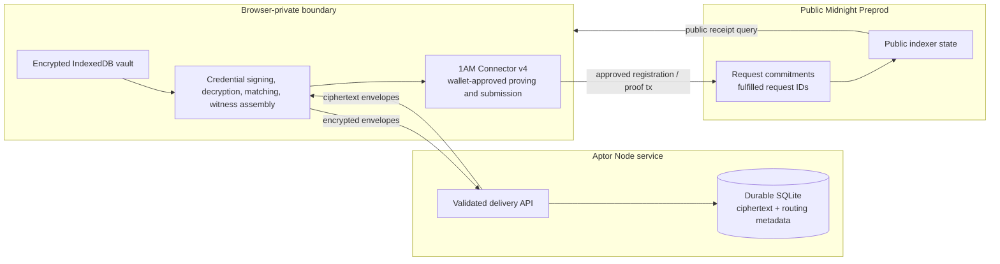

# Aptor architecture

## Status

Milestone 7 prepares the existing device-bound, multi-role product for a public
Preprod release without changing its Compact logic. Every private role state,
the raw account capability, and the P-256 private encryption key persist only
inside one encrypted IndexedDB account vault. Durable SQLite routes encrypted
envelopes and caches public status; Midnight remains authoritative for request
registration, proof fulfillment, and replay state. The Compact contract is
deployed and indexer-queryable on Preprod at
`86577ec2059e8e0ee13216e6e92d90dda54cae79d75118e1e8ed81beb8becff4`;
public hosting and the real request/fulfillment scenario remain pending.

## System context



The server can observe profile identifiers, routing relationships, envelope
type and size, delivery timing, public request IDs, and public transaction IDs.
Credential plaintext, private work values, vault secrets, issuer keys, and
witness material remain inside the browser-private boundary.

```text
Professional browser        Aptor delivery service          Issuer / Verifier
  │                                  │                            │
  ├── hashed invite capability ─────>│                            │
  │                                  │<── one-time redemption ────┤ Issuer
  │<──────── encrypted credential envelope ───────────────────────┤
  │                                  │                            │
  │<──────── encrypted registered request envelope ───────────────┤ Verifier
  │                                  │                            │
  ├── ephemeral witness + wallet ────────────────────────────────>│ Midnight
  │                                  │                            │ request + receipt
  │                                  │<── public status cache ─────┤
  │                                  │                            │
  └── portable files remain an Advanced fallback ─────────────────┘
```

The issuer attests to work. Aptor verifies cryptographic authorization and
request predicates; it does not establish the legal identity behind a key or
the factual truth of the issuer's claim.

## Credential construction

`WorkCredentialV1` contains:

- a random 32-byte credential ID;
- a holder-secret commitment;
- a depth-5 private skill-tree root;
- duration in `Uint<16>` months;
- production-delivery status;
- client rating in hundredths, restricted to 0–500.

The issuer signs a persistent hash of every field under
`aptor:work-credential:v1`. The existing Jubjub Schnorr verifier follows the
official Midnight ZK Loan construction. The issuer signing key never enters the
contract or professional witness.

## Private skill set

Display skills are NFKC-normalized, trimmed, lowercased, and whitespace-collapsed.
The UTF-8 result is limited to 64 bytes and hashed with its byte length under
`aptor:skill:id:v1`. IDs are deduplicated, sorted lexicographically, and placed
in a depth-5 Merkle tree. Up to 32 unique skills are supported. Unused leaves
repeat the final real leaf, so padding does not introduce another provable
skill.

The verifier requests one public canonical skill ID. The credential's full
skill list and the selected membership path stay private.

## Private accepted-issuer membership

The verifier builds a depth-5 Merkle tree from up to 32 issuer Jubjub public
keys. Keys are deduplicated and sorted by `(x, y)`; unused leaves repeat the
final accepted key. Only the root enters `ProofRequestV1`.

The professional supplies the specific issuer key and path privately. Compact
verifies both the credential signature and that the private key leaf resolves
to the request's accepted root. Public artifacts therefore identify the
verifier-defined set commitment, not the signing member.

## Request lifecycle

`ProofRequestV1` binds its request ID, accepted issuer root, predicate flags,
and predicate values under `aptor:proof-request:v1`.

1. `createProofRequest(requestId, commitment)` rejects duplicate IDs and stores
   only the commitment.
2. `proveAgainstRequest(request)` rejects meaningless requests, recomputes the
   commitment, checks registration and replay state, then verifies the private
   credential.
3. Every enabled predicate must pass before `fulfilledRequests` is updated.
4. A second fulfillment attempt is rejected.

The request structure is public and may be transported off chain. A successful
set membership entry is the request's public verification receipt; there are no
separate per-criterion booleans.

## Compact responsibilities

1. Bind all credential and request fields to fixed, domain-separated hashes.
2. Verify the issuer's Jubjub Schnorr signature.
3. Verify private issuer membership against the public accepted root.
4. Recompute holder-secret binding.
5. Verify one private skill membership path when enabled.
6. Enforce enabled duration, production, and rating requirements.
7. Reject duplicate requests and fulfilled-request replay.
8. Store only request commitments and fulfillment IDs.

The contract does not store the credential, specific issuer key, issuer or
skill path, holder data, private skill root/list, exact credential values,
client identity, or project identity.

## Repository boundaries

- `apps/web` owns the role-aware product UI and client orchestration.
- `packages/aptor-browser` owns Web Crypto, runtime file schemas, encrypted
  IndexedDB sessions, account and envelope crypto, official connector
  discovery, provider assembly, public queries, contract calls, and
  proof-scoped private state.
- `packages/aptor-delivery` owns SQLite migrations, prepared queries,
  capability authentication, authorization, rate limits, ciphertext routing,
  notifications, and public status caching.
- `packages/shared` owns versioned product and delivery protocol schemas.
- `contracts/aptor-credential` owns Compact, issuer/request utilities, trees,
  private witnesses, and generated-runtime tests.
- `packages/aptor-midnight` owns local providers, contract API, wallet adapter,
  health checks, and the serial LocalNet test.
- `docs` owns implemented trust/privacy decisions and reproducible evidence.

## Provider architecture

```text
encrypted Aptor vault
         │ explicit credential selection
         ▼
ephemeral browser private state ─── browser-served ZK artifacts
         │                                   │
         └──────── generated contract ───────┘
                         │
        ┌────────────────┼─────────────────┐
        ▼                ▼                 ▼
 official wallet     indexer public    disabled/redacted
 proof + balance     data provider     logger provider
        │                │
        └──── submit ────┴────> finalized public receipt
```

The durable vault never becomes a generic Midnight private-state database. A
proof action hydrates only the selected request/credential material, and a
`finally` path clears it after success or failure. The provider deliberately
cannot export private state or maintenance keys.

Browser ZK files are copied from the compiled contract boundary into
`apps/web/public/zk/aptor` during `predev` and `prebuild`. The sync script checks
all six required files. The large `proveAgainstRequest.prover` is approximately
11 MB and is fetched only when that circuit is needed.

## Account and delivery architecture

`AptorAccountVaultV1` contains the public profile copy, raw access capability,
P-256 private encryption key, Professional holder state, Issuer signing state,
and Verifier trust/request state. PBKDF2-SHA-256 and AES-256-GCM protect the
complete account container. Role switching changes the workspace; it does not
change the account.

The public `AptorProfileV1` contains the profile ID, normalized handle, display
name, P-256 public encryption key, public holder profile, and public Issuer
profile. The server stores only a SHA-256 hash of the browser-generated
256-bit access capability. SHA-256 is appropriate because the input is a
uniform, high-entropy bearer capability rather than a human password.

SQLite is the durable MVP adapter. All queries are prepared, migrations are
versioned in source, foreign keys are enabled, and WAL mode supports concurrent
reads. The Railway deployment attaches one persistent volume at `/data` and
stores the database at `/data/aptor.sqlite`. This deliberately limits the MVP
to one service instance; a future multi-instance deployment would replace only
the adapter with managed SQL while preserving the service interfaces and
authorization checks.

The server observes public profiles, sender/recipient relationships, envelope
type and size, timing, invitation relationships, public request IDs,
transactions, network, and cached public status. It cannot derive an envelope
key because it never receives the recipient private key or ephemeral private
key.

## Pinned local stack

Verified on 2026-07-17:

| Component                           | Version                        |
| ----------------------------------- | ------------------------------ |
| Node.js                             | `24.15.0`                      |
| Compact devtools                    | `0.5.1`                        |
| Compact compiler/language/runtime   | `0.31.1` / `0.23.0` / `0.16.0` |
| Midnight.js and testkit-js          | `4.1.1`                        |
| Wallet SDK                          | `1.2.0`                        |
| Local node / indexer / proof server | `0.22.5` / `4.0.2` / `8.0.3`   |

Official references:

- [Midnight compatibility matrix](https://docs.midnight.network/relnotes/support-matrix)
- [Midnight.js guide](https://docs.midnight.network/sdks/official/midnight-js)
- [Wallet SDK guide](https://docs.midnight.network/sdks/official/wallet-developer-guide)
- [Official ZK Loan example](https://github.com/midnightntwrk/example-zkloan)

## Remaining decisions

1. Public-host authorization, the real Preprod request/proof scenario, and its
   release evidence.
2. Production identity, recovery, capability renewal, and multi-device sync.
3. Multi-instance database adapter, backup automation, and distributed rate limiting.
4. Issuer domain/legal-identity verification and key rotation.
5. Credential expiry, revocation, and request expiration.
6. Multi-skill and multi-credential proof composition.
7. Rate limits against adaptive threshold inference.
8. Migration to a native Compact signature verifier when available.
